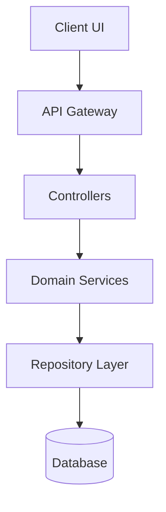

# Living Project Documentation & Obsidian Integration Guide

Runbook for maintaining synchronized project architecture docs, ADRs, and Obsidian vault bridges.

## 1. Documentation Structure

```
docs/
  ├── overview.md       # High-level vision, stack, and setup
  ├── architecture.md   # Layered system architecture & Mermaid diagrams
  ├── workflows.md      # Sequence flows & data contracts
  └── adr/              # Architecture Decision Records
       └── 0001-record-architecture-decisions.md
```

---

## 2. Standard Templates

### Architecture Diagram (Mermaid)
```markdown

```

### Architecture Decision Record (`docs/adr/0001-template.md`)
```markdown
# ADR 0001: [Decision Title]
- **Status**: [Proposed | Accepted | Superseded]
- **Date**: YYYY-MM-DD

## Context & Problem Statement
[Problem definition and constraints]

## Considered Options
1. Option 1: [Details]
2. Option 2: [Details]

## Decision & Rationale
We chose **Option 1** because [trade-off rationale].

## Consequences
- **Positive**: [Benefits]
- **Negative**: [Trade-offs accepted]
```

---

## 3. Obsidian Vault Sync Bridge

To sync application docs to `D:/dev/obsidian/hola`:
1. **Project Hubs**: Maintain `projects/[project]/_[project].md`.
2. **Technical Guides**: Colocate domain cheat sheets in `areas/tech/[domain]/`.
3. **Frontmatter Integrity**: Use valid YAML `type`, `project`, and `tags` keys.

---

## 4. Verification & Testing

Validate documentation integrity:
1. **Markdown & Link Linting:** Ensure all internal file links use valid relative paths.
2. **Mermaid Rendering Check:** Verify Mermaid syntax is valid with zero unquoted brackets.
3. **Frontmatter Check:** Verify all synced vault files contain valid YAML metadata blocks.

---

## 5. Common Pitfalls & Negative Constraints

- **Never leave docs outdated:** Update `docs/` in the same PR or commit as architectural changes.
- **Never commit secrets:** Ensure `.env` tokens and connection strings are excluded from docs.
- **Avoid overly detailed diagrams:** Focus on component boundaries rather than private internal functions.
